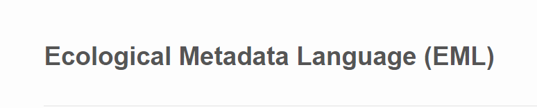
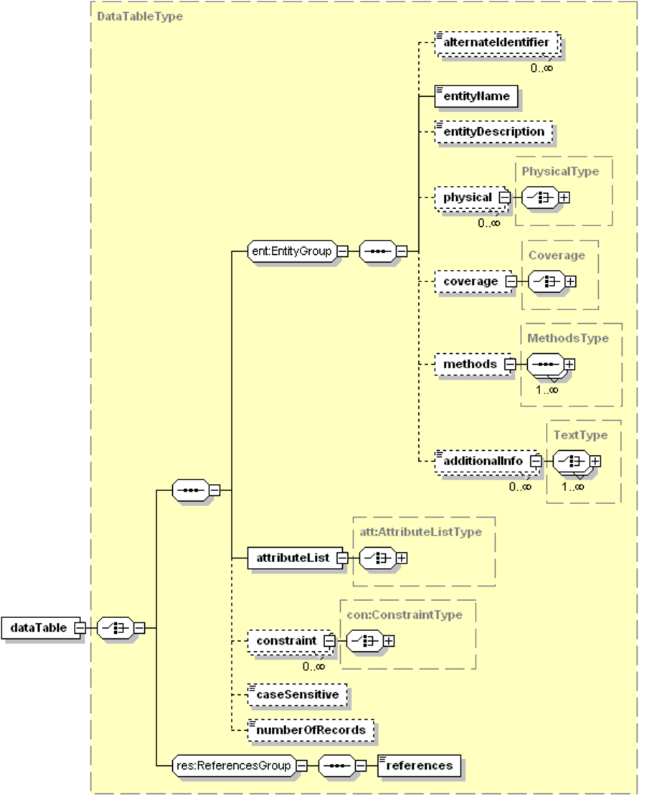

<div align="left">

</div>
<div align="left">

</div>
<div align="left">

</div>


##Tutorial goals

- Introduction to the Ecological Metadata Language (EML)

- Use R to build EML for a mock dataset

- Validate EML and write to file

- Install Git and configure to track file versioning in RStudio

- Set up GitHub account and repository

- Push local content to GitHub for sharing and collaboration


##What is EML?


- The Ecological Metadata Language (EML) is a metadata standard developed by the ecological community to communicate essential information about how a dataset was created and what the dataset contains.

- EML is written in the Extensible Markup Language (XML). A language that is machine and human readable, modular, and cabable of storing large amounts of information.

- EML is composed of nested element modules resembling a tree or hierarchical structure.

- The modular nature of EML makes it accomodating of the diverse datasets encountered in the ecological and environmental sciences.

- The extensible character of EML facilitates evolution of the EML standard as best practices develop and new data types are created.

- EML provides a basis for discoverability and reuse of data long after the goals of a data creating research project have been fullfilled.


##Why use R to make EML?

- R is used widely by the environmental sciences community.

- R is effective and adaptable to workflows of professional information managers and individual research projects.

- Thus there is considerable potential to create EML by multiple parties in the environmental sciences community thereby increasing the number of publicly available and high quality data packages.


##The EML schema

- The EML schema is a complex structure of tremendous detail that can really only be learned by reading the technical documentation provided by the EML working group. The Knowledge Network for Biocomplexity (KNB) hosts current and past versions of the EML schema, and is the locale of future developments to this standard. [Click here to access this documentation](https://knb.ecoinformatics.org/#external//emlparser/docs/index.html).

- Don't be discouraged by the apparent learning curve. There are many resources and a community of support to help you learn. The Long Term Ecological Research (LTER) community hosts a set of best practices to guide you where to place dataset specific information in the EML schema as you construct it. [Click here to access this documentation](https://im.lternet.edu/node/910).

- Below is an example of what the EML structure looks like for the dataTable element. The dataTable element is a child element of the dataset element (not shown). We are going to start our exercise by building the \<dataTable> element. Specifically we will create the \<attributeList> and \<physical> elements then combine these to create the \<dataTable> element.

<div align="left">

</div>


##Exercise! (download files for this demonstration)

- [Get the supporting files for this exercise here](https://github.com/EDIorg/tutorials/tree/master/make_eml_with_r/exercise_files).

- One at a time, click each file then _right-click_ the _Raw_ button and select _Save link as_.

- Create a working directory on your desktop for these files called _dataset\_eml_. Move the supporting files there.


##Exercise (install the EML R package)

- Install the EML R code package we will be working with. This excellent package developed by Boettiger et al. (2017) provides us with functions to build up any part of the EML schema we may want to use in our metadata. The package is [available for download on CRAN](https://cran.r-project.org/web/packages/EML/index.html), and is [under development at GitHub](https://github.com/ropensci/EML). Let's install this package from CRAN and load it so we can use it!

    ```{r eval = FALSE}
install.packages("EML", repos = c("http://packages.ropensci.org", "https://cran.rstudio.com"))
    
library(EML)
```    

Carl Boettiger, Maëlle Salmon, Claas-Thido Pfaff, Matt Jones, Anna Liu, Karthik Ram, Bryce Mecum, Duncan Temple Lang, Edmund Hart, Matthias Grenié, Ivan Hanigan. (2017, May 11). ropensci/EML:v1.0.3. Zenodo. https://doi.org/10.5281/zenodo.574208


##Exercise (create the \<attributeList> element)

- We will begin by creating the metadata for the example data table used in this exercise. This information is stored under the \<attributeList> element in EML. Since there are several highly detailed and nested elements in EML, like that of \<attributeList>, authors of the EML package have provided us with a few useful functions to handle this. While the vignette example (see documentation for this package under the 'Packages' tab of RStudio) for creating \<attributeList> shows us how to enter this information long form into the Source Window of RStudio, we will use the different approach of supplying this information by reading in a set of tables containing this information. The format of these tables and rules governing the placement of content within them is specified in the EML R code package documentation for the `set_attributes` function. Access this documentation with:

    ```{r eval = FALSE}
?set_attributes
```    

- NOTE: The files we are using in this excercise can be downloaded from the [GitHub repository for this excercise here](https://github.com/EDIorg/tutorials/tree/master/make_eml_with_r).

- Read in the file 'dataset_attributes.txt'. NOTE: where you see 'file.path', you enter the full path to this file. This tells R where to find it.

    ```{r eval = FALSE}

attributes_data <- read.table(file = "C:\\Users\\Colin\\Desktop\\dataset_eml\\dataset_attributes.txt",
                              header = TRUE,
                              sep = "\t",
                              as.is = TRUE)

attributes_data
```    

- Some notes on the content of this file: _attributeName_ is the list of column names in the data table. _attributeDefinition_ is the definition for the listed attributeNames. _formatString_ is the format string for Date type data. This is not supplied if attribute is not Date type. _definition_ seems redundant, but is required for attributes containing factor or character data. These fields are just copies of the corresponding attributeDefinition. _unit_ is the specific unit name listed in the standard unit dictionary and must be supplied for any attribute of numeric data. See `?set_attributes` for more details on units. _numberType_ is the type of number the attribute contains and is required for numeric type data. _class_ is the attributes data type. These options are controlled. See `?set_attributes` for details.

- Because our data contain attributes of _class_ factor, we need to define factor codes. This information is stored in 'dataset_factors.txt'. Let's read it in to the R workspace and take a look.

    ```{r eval = FALSE}
    
file.path <- "C:\\Users\\Colin\\Desktop\\dataset_eml\\dataset_factors.txt"         
    
factors_data <- read.table(file = file.path,
                           header = TRUE,
                           sep = "\t",
                           as.is = TRUE)

factors_data
```    

- Some notes on the content of this file: _attributeName_ is the attribute containing factors. _code_ is the corresponding factor code. _definition_ is the definition for the code.

- Now that we have this information read into the R environment we can use the `set_attributes` function to create the \<attributeList> element.

    ```{r eval = FALSE}

attributes_element <- set_attributes(attributes = attributes_data,
                                     factors = factors_data,
                                     col_classes = attributes_data$class)

attributes_element        
```    

- There it is translated into the XML format!


##Exercise (create the \<physical> element)

- Now we should include some information on the physical characteristics of the data table, i.e. the file name, file size, field delimiter, etc. This will help future users understand the format of the data table and how to ingest it into thier workspace. We'll use another high-level function to create the highly nested structure of the \<physical> element.

    ```{r eval = FALSE}

physical_element <- set_physical(objectName = "demo_data.csv",
                               numHeaderLines = "1",
                               recordDelimiter = "\\r\\n",
                               attributeOrientation = "column",
                               fieldDelimiter = ",",
                               size = "293348",
                               sizeUnit = "byte")

physical_element        
```    

- There we have it! The \<physical> element has been created. If we didn't want to reference the full detail of \<physical> back at KNB, but rather wanted a quick reminder of the available fields within \<physical> we can use `getSlots` to see these and the required input formats.

    ```{r eval = FALSE}
    
getSlots("physical")
    
```    

- `getSlots` returns a pairwise list of acceptable fields (top row), and required input formats (bottom row).


##Exercise (use \<attributeList> and \<physical> to create \<dataTable>)

- Now that we have \<attributeList> and \<physical> in place, we can use them to create \<dataTable>.

    ```{r eval = FALSE}
    
dataTable_element <- new("dataTable",
                  entityName = "demo_data.csv",
                  entityDescription = "Data table for make EML with R demonstration.",
                  physical = physical_element,
                  attributeList = attributes_element,
                  numberOfRecords = "2192")

dataTable_element
```    

- OK. We'll set \<dataTable> aside for now and create some of the other elements for our datasets EML.


##Exercise (create \<coverage>)

- Another element required for our EML is \<coverage>. With this we'll provide some basic info on the temporal and geographic coverage of our dataset.

- Remember, use `getSlots("coverage")` to access what information gets stored here and the corresponding input requirements.

    ```{r eval = FALSE}
    
coverage_element <- set_coverage(beginDate = "2010-01-01",
                                 endDate = "2016-01-01",
                                 geographicDescription = "Some where in a geographic location far far away.",
                                 westBoundingCoordinate = -121.9,
                                 eastBoundingCoordinate = -121.3,
                                 northBoundingCoordinate = 38.5,
                                 southBoundingCoordinate = 37.7)

coverage_element
```    

- Looks like an EML coverage element to me!

##Exercise (create \<methods>)

- OK. Now let's create the methods element. Another high-level function, `set_methods`, is available to do this. We could type out all our methods in the RStudio Source window, but this environment doesn't support spelling and grammar checking, so we'll write our methods in a separate .txt file and import it to the workspace and set as \<methods> all at the same time.

    ```{r eval = FALSE}
    
methods_element <- set_methods(methods_file = "C:\\Users\\Colin\\Desktop\\dataset_eml\\dataset_methods.txt")

methods_element
```    

- The paragraph breaks have been recognized by `set_methods`. This function also recognizes more detailed formatting from Microsoft Word and other markdown documents. Be careful not to use special characters and non-UTF-8 characters and symbols. EML can't handle them. As a result the EML document becomes invalid. So make a conscious effort to present your text based inputs to EML with the bare essentials and as little formatting and symbolization as possible.


##Exercise (create \<abstract>)

- Another method for translating text based information to EML is to use `set_TextType`. This again allows us to import MS Word documents or markdown files and convert them to EML. We'll use `set_TextType` in combination with `as` to create \<abstract>. `as` takes the object input as the first argument to the `as` function (in this case our abstract text) and then assigns the elements name according to the second argument (in this case "abstract"). We could enter any character string into the second argument, but we'd get an error when we go to validate it against the EML schema.

    ```{r eval = FALSE}
    
abstract_element <- as(
  set_TextType(file = "C:\\Users\\Colin\\Desktop\\dataset_eml\\dataset_abstract.txt"),
  "abstract")

    
abstract_element
```    


##Exercise (create \<keywordSet>)

- To create a \<keywordSet> or multiple instances of \<keywordSet> we'll use the functions `new` and `c`. `new` works similarly to `as` except we define the element name first followed by a series of arguments for the children elements subset under the parent element. `c` concatenates the multiple instances of \<keywordSet> to a _ListOfkeyword_ as required by the slot for \<keywordSet>. If we run `getSlots("keywordSet")` we can see this expected data type. We are going to create 2 \<keywordSet> because each set is selected from a different thesaurus. We will separate our 2 instances of \<keywordSet> with a comma within the `c` function.

    ```{r eval = FALSE}

keywords_element <- c(new("keywordSet",
                          keywordThesaurus = "LTER controlled vocabulary",
                          keyword = c("river",
                                      "freshwater",
                                      "aquatic ecosystems",
                                      "brackish water",
                                      "estuarine",
                                      "delta")),
                      new("keywordSet",
                          keywordThesaurus = "LTER core area",
                          keyword = c("disturbance")))
    
keywords_element    
```    


##Exercise (create \<dataset>)

- OK. Now we have all the major elements for our parent element \<dataset>. We'll use `new` to create \<dataset> and nest the children within the parent along with a \<title>.

    ```{r eval = FALSE}
    
dataset_element <- new("dataset",
                       title = "Mississippi River floods",
                       abstract = abstract_element,
                       methods = methods_element,
                       keywordSet = keywords_element,
                       coverage = coverage_element,
                       dataTable = dataTable_element)
    
dataset_element
```    


##Exercise (create \<eml>)

- Now that we have \<dataset> completed we can build \<eml>. Of course there is much more information we could provide about our dataset in the EML schema, but we'll draw the line here for the sake of our demonstration. Let's use `new` to create \<eml> as we have been doing for several of our elements. Let's also provide the location of the EML schema, a data package ID and the system this data package is apart of.

    ```{r eval = FALSE}
    
eml <- new("eml",
           schemaLocation = "eml://ecoinformatics.org/eml-2.1.1  http://nis.lternet.edu/schemas/EML/eml-2.1.1/eml.xsd",
           packageId = "edi.91.1",
           system = "edi",
           dataset = dataset_element)

eml    
```    


##Exercise (validate the EML)

- We can check that our EML complies with the official schema by running it through the handy `eml_validate` function. If valid we will see the message _TRUE_ returned to the Console window. If invalid we will recieve _FALSE_ and some details about the first error encountered by the validation check.

    ```{r eval = FALSE}
    
eml_validate(eml)
    
```    


##Exercise (make \<creator> and \<contact>)

- Schucks! Looks like we forgot to include \<creator>, which reminds us, we also need to provide a \<contact> for this dataset. Let's build these and run validation again. This time we'll use `new` inside a `new`!

    ```{r eval = FALSE}
    
creator_element <- new("creator",
                       individualName = new("individualName",
                                            givenName = "Colin",
                                            surName = "Smith"),
                       organizationName = "Environmental Data Initiative",
                       positionName = "Information Manager",
                       electronicMailAddress = "colin.smith@wisc.edu")    
    
contact_element <- new("contact",
                       individualName = new("individualName",
                                            givenName = "Colin",
                                            surName = "Smith"),
                       organizationName = "Environmental Data Initiative",
                       positionName = "Information Manager",
                       electronicMailAddress = "colin.smith@wisc.edu")
    
```    

- We'll have to rebuild our \<dataset> and make space for \<creator> and \<contact> ...


    ```{r eval = FALSE}
    
dataset_element <- new("dataset",
                       title = "Mississippi River floods: Return of the DENITRIFICATION!",
                       creator = creator_element,
                       contact = contact_element,
                       abstract = abstract_element,
                       methods = methods_element,
                       keywordSet = keywords_element,
                       coverage = coverage_element,
                       dataTable = dataTable_element)
    
```    

- ... and rebuild \<eml> and validate.

    ```{r eval = FALSE}
    
eml <- new("eml",
           schemaLocation = "eml://ecoinformatics.org/eml-2.1.1  http://nis.lternet.edu/schemas/EML/eml-2.1.1/eml.xsd",
           packageId = "edi.91.1",
           system = "edi",
           dataset = dataset_element)
    
```    


    ```{r eval = FALSE}
    
eml_validate(eml)
    
```    

- Great! No errors! We have created EML conforming to the official schema. Now we can use `write_eml` to write the .xml file out to the location of our choosing.

    ```{r eval = FALSE}
    
write_eml(eml,
          "C:\\Users\\Colin\\Desktop\\dataset_eml\\dataset_eml.xml")
    
```    


##Exercise (Set up Git and GitHub for RStudio)

- RStudio interfaces nicely with Git (and SVN) and GitHub allowing you to share your R code with others and collaborate.

- First we will need to install Git on our computer and initialize. [Instructions for installing and setting up Git for your computer are here](https://git-scm.com/book/en/v2/Getting-Started-Installing-Git). The Environmental Data Initiative also has a brief tutorial on using Git and GitHub with the command line. [This tutorial is available here](https://cdn.rawgit.com/EDIorg/tutorials/3354b142/intro_to_git_and_github/introduction_to_file_versioning_with_git_and_github.html).

- Next we'll need to create a GitHub account. [You can sign up here!](https://github.com/join).

- Now we need to link Git and RStudio. [An excellent set of instructions for this are here](https://support.rstudio.com/hc/en-us/articles/200532077-Version-Control-with-Git-and-SVN). Follow these instructions up until the section _Using a directory already under version control_.

- Link GitHub and RStudio. [Instructions for this step are here](https://www.r-bloggers.com/rstudio-and-github/). Follow the instructions under the section _Setup Git on RStudio and Associate with GitHub_.

- Create a repository on your GitHub:

    - Navigate to the repositories tab of your profile page.

    - In the upper right hand corner click green button `New` to create a new repository. 

    - Name it `eml_project` after the local repository we will be creating on our computer.

    - Provide a brief description of the repository.

    - Initialize this repository with a README file.

    - Click the green `create repository` button.
    
- Create a clone of this remote repository on the local workspace of our computer. In other words copy the GitHub repository to a location of your choosing on you computer:
    
    - In RStudio go to File/New Project and select Version Control
    
    - Select _Checkout a project from a version control repository_.
    
    - Select _Git Clone a project from a Git repository_.
    
    - Go back to your GitHub repository and click the green _Clone or Download_ button and copy the URL.
    
    - Return to RStudio and paste the URL in the _Repository URL_ field. Set the location of where this GitHub repository will be stored on your computer. It will be cloned under the parent directory path you enter in the field _Create a project as a subdirectory of_. Click _Create Project_. This will create a new Git version controlled RStudio project in the specified parent directory. This project is a clone of the remote repository you set up in GitHub. Take a look at the contents. You should see a copy of the README file you created there.

- Now if you return to the RStudio environment you will see some new features. In the _Environment and History window you should see a tab called Git. This tab contains a GUI interface for you to control version control of files in this projects directory.

- Let's begin version control for our R code and supporting .txt files used in this demonstration.

##Exercise (move files to project directory and track with Git)

- Copy the files from your directory _dataset\_eml_ into your newly cloned _eml\_project_ directory. Remember you specified the location of where the cloned _eml\_project_ directory is located in the previous step.

- Return to RStudio and under the Git tab you should see the list of files you just added with check boxes next to them. Check these for the files you just copied in (i.e. the files you want to version control). Checking these boxes will stage these file version so we can take a snap shot of them and provide an associated commit message.

- Click the _Commit_ button in the Git tab window, and a new window should pop up with some new GUI features for the files you are about to commit. Explore these features, they are quite nice! When ready provide a commit message for these files. Something along the lines of "Initialize version control with commit message."

- Now these files have disappeared from the RStudio Git window. That's because you have no new saved changes to these files. If you did they would reappear and you could repeat the stage and commit process.


##Exercise (push contents of local repository to remote repository)

- In the RStudio Git window, click the button _Push_. A window will pop-up with some message. This message indicates a successful transfer of the files to your remote GitHub repository. Are they there? Go check. You may need to refresh the page.

- Yep! There they are!


##Thanks for your attention!

- Whew! Who ever said making EML is was easy ... maybe no one? This is all quite a meticulous process! But you may be seeing ways to streamline some of these steps. Especially as you become more familiar with building EML with R and get deeper into the EML details you will discover ways to extract information from your dataset to include with the EML in automated processes. So hang in there! This flexible tool will save you time in the long run.

- NOTE: Not only can you build EML with the EML R package, but you can also read in an EML file and extract elements from it! Explore these functions in the user documentation for the EML R code package.

- Cheers!


<div align="left">

</div>


