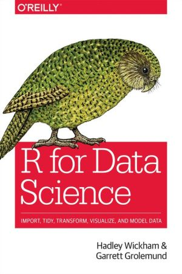

Transform and visualize data in R with "tidyverse" (1)
=======================================================
author:
autosize: true


<style>
.small-code pre code {
  font-size: 1em;
.footer {
    color: red; background: #E8E8E8;
    position: fixed; top: 90%;
    text-align:center; width:100%;
.midcenter {
    position: fixed;
    top: 50%;
    left: 50%;
}
}
}
</style>

</img>

<div class="footer" style="margin-top:300px;font-size:100%;">
Environmental Data Initiative<br />17 October 2017</div>


Tutorial goals
========================================================
<br />
<br />
Introduction to:
- Data tidying using "tidyr"
- Data transformation using "dplyr"
- Data plotting using "ggplot2"

This tutorial focuses on "dplyr" and uses "ggplot2".

Main resources for this tutorial:
========================================================

<br />

"R FOR DATA SCIENCE"
<br />
<br />
by Hadley Wickham and Garrett Grolemund (O'Reilly). Copyright 2017 Garrett Grolemund, Hadley Wickham, 978-1-491-91039-9
<br />

<style>
.small-code pre code {
  font-size: 1em;
.footer {
    color: red; background: #E8E8E8;
    position: fixed; top: 90%;
    text-align:center; width:100%;
.midcenter {
    position: fixed;
    top: 50%;
    left: 50%;
}
}
}
</style>

</img>

<br />
<br />


Main resources for this tutorial (continued):
========================================================
<br />
<br />
Two example data sets from the EDI repository:


- "Rainfall manipulation study vegetation data from the Chihuahuan Desert Grassland and Creosote Shrubland at the Sevilleta National Wildlife Refuge, New Mexico (2003-2011)": http://dx.doi.org/10.6073/pasta/361fbce9ce7d4d9530e34b4a8ee3c02e

-  "Eddy covariance data measured at the CAP LTER flux tower located in the west Phoenix, AZ neighborhood of Maryvale from 2011-12-16 through 2012-12-31": http://dx.doi.org/10.6073/pasta/fed17d67583eda16c439216ca40b0669.

<br />
<br />
<br />
R CHEAT SHEETS: https://www.rstudio.com/resources/cheatsheets/

- Data Transformation Cheat Sheet
- Data Visualization Cheat Sheet

Important dplyr functions for data manipulation
========================================================
<br />
<br />
- SELECT(): select variables - COLUMNS of a data table
- MUTATE(): modify or create new COLUMNS
- FILTER(): filter observations by their values - ROWS of a data table
- ARRANGE(): reorder ROWS of a data table
- SUMMARIZE(): collapse values to a single summary value, for example calculate mean values
- GROUP_BY(): allows to apply function on selected values instead of all data of a column.


========================================================
class: small-code
IMPORT DATA:"Rainfall manipulation study vegetation data from the Chihuahuan Desert Grassland and Creosote Shrubland at the Sevilleta National Wildlife Refuge, New Mexico (2003-2011)"
<br />
http://dx.doi.org/10.6073/pasta/361fbce9ce7d4d9530e34b4a8ee3c02e
<br />
<br />


```r
#
# assign to file1 the path to table and table name
# read table with read_csv and assign to df
# use "<-" as "assign to" command
#
file1 <- "sev147_droughtveg_11142011.csv"
df1 <- read_csv(file1)
#
# list the data structure
#
df1
```

```
# A tibble: 111,484 x 12
        Date     Season  Site  Plot Transect Meter Species Cover Height
       <chr>      <chr> <chr> <int>    <int> <int>   <chr> <dbl>  <int>
 1 4/24/2003 SPRING2003     G     6        1     8   BOER4   5.0   -888
 2 4/24/2003 SPRING2003     G     6        1     8   BOER4  10.0     21
 3 4/24/2003 SPRING2003     G     6        1     4    ROCK  45.0   -888
 4 4/24/2003 SPRING2003     G     6        1     4    SOIL  60.0   -888
 5 4/24/2003 SPRING2003     G     6        1     4    LITT  10.0   -888
 6 4/24/2003 SPRING2003     G     6        1     4   ASMIM   0.3      3
 7 4/24/2003 SPRING2003     G     6        1     4   PLPA2   0.5      3
 8 4/24/2003 SPRING2003     G     6        1     4    HODR   2.0      6
 9 4/24/2003 SPRING2003     G     6        1     4    PHIN   4.0     13
10 4/24/2003 SPRING2003     G     6        1     4   BOER4   2.0   -888
# ... with 111,474 more rows, and 3 more variables: Count <int>,
#   Comments <chr>, Year <int>
```

Questions we might ask about the data set
========================================================
class: small-code
<br />
<br />
- What is the total "Species" "Count" in a particular "Year" at each of the three "Sites"?
- How does the "Count" of a particular "Species" change over the "Years" at a particular "Site"?
- Are there differences in "Species" "Count" by season?
<br />
<br />
<br />
Column names of data frame are given in quotation marks.
<br />

Select columns: select()
========================================================
class: small-code
<br />
<br />


```r
# 
# Select columns of interest for data analysis.
#
t1 <-  select(df1, Date, Season, Site, Plot, Species, Count, Year)
t1
```

```
# A tibble: 111,484 x 7
        Date     Season  Site  Plot Species Count  Year
       <chr>      <chr> <chr> <int>   <chr> <int> <int>
 1 4/24/2003 SPRING2003     G     6   BOER4  -888  2003
 2 4/24/2003 SPRING2003     G     6   BOER4     2  2003
 3 4/24/2003 SPRING2003     G     6    ROCK  -888  2003
 4 4/24/2003 SPRING2003     G     6    SOIL  -888  2003
 5 4/24/2003 SPRING2003     G     6    LITT  -888  2003
 6 4/24/2003 SPRING2003     G     6   ASMIM     1  2003
 7 4/24/2003 SPRING2003     G     6   PLPA2    23  2003
 8 4/24/2003 SPRING2003     G     6    HODR     2  2003
 9 4/24/2003 SPRING2003     G     6    PHIN    12  2003
10 4/24/2003 SPRING2003     G     6   BOER4  -888  2003
# ... with 111,474 more rows
```
<br />
<br />

Plot with ggplot and geom_point
========================================================
class: small-code
<br />
ggplot(data=DATA)+geom_function(mapping=aes(MAPPINGS))
<br />

```r
#
# plot "Count" vs."Date" & NOTICE DIFFERENT MISSING VALUES! 
#
p <- ggplot(t1) + geom_point(mapping = aes(x=Date,y=Count))
p
```


Modify column values: mutate() & pipe command %>%
========================================================
class: small-code
<br />
<br />


```r
#
# assign NA to missing values in column "Count"
# substitute "SPRING(YEAR)" and "FALL(YEAR)" in column "Season" with "SPRING" and "FALL"
# change data type of column "Plot" from INTEGER to CHARACTER for use as categorical variable
#
t2 <- mutate(t1,Count = replace(Count, which(Count==-888|Count== -999),NA)) %>%  
       mutate(Season=ifelse(str_sub(Season,1,1)=="S","SPRING","FALL")) %>% 
       mutate(Plot = as.character(Plot),Year = as.character(Year))
t2
```

```
# A tibble: 111,484 x 7
        Date Season  Site  Plot Species Count  Year
       <chr>  <chr> <chr> <chr>   <chr> <int> <chr>
 1 4/24/2003 SPRING     G     6   BOER4    NA  2003
 2 4/24/2003 SPRING     G     6   BOER4     2  2003
 3 4/24/2003 SPRING     G     6    ROCK    NA  2003
 4 4/24/2003 SPRING     G     6    SOIL    NA  2003
 5 4/24/2003 SPRING     G     6    LITT    NA  2003
 6 4/24/2003 SPRING     G     6   ASMIM     1  2003
 7 4/24/2003 SPRING     G     6   PLPA2    23  2003
 8 4/24/2003 SPRING     G     6    HODR     2  2003
 9 4/24/2003 SPRING     G     6    PHIN    12  2003
10 4/24/2003 SPRING     G     6   BOER4    NA  2003
# ... with 111,474 more rows
```

Arrange order of rows:arrange()
========================================================
class: small-code
<br />
<br />


```r
#
# arrange rows in order of descending values of column "Count"
#
arrange(t2, desc(Count))
```

```
# A tibble: 111,484 x 7
         Date Season  Site  Plot Species Count  Year
        <chr>  <chr> <chr> <chr>   <chr> <int> <chr>
 1   6/5/2005 SPRING     M     6   CRCR3   700  2005
 2  11/7/2005   FALL     G     2   PLPA2   500  2005
 3  11/7/2005   FALL     G     3   PLPA2   500  2005
 4 10/25/2006   FALL     M     2   PLPA2   450  2006
 5  11/1/2005   FALL     M     1   PLPA2   400  2005
 6  11/2/2005   FALL     M     4   CRCR3   400  2005
 7  11/2/2005   FALL     M     4   PLPA2   400  2005
 8  11/2/2005   FALL     M     4   PLPA2   400  2005
 9  11/2/2005   FALL     M     3   CRCR3   400  2005
10  11/8/2005   FALL     C     8   CRCR3   400  2005
# ... with 111,474 more rows
```


Filter rows by value: filter()
========================================================
class: small-code
<br />
<br />


```r
#
# What is the total "Species" "Count" in a particular "Year" at each of the three "Sites"?
#
# filter all values for the year 2010
#
t3 <- filter(t2, Year==2010)
t3
```

```
# A tibble: 9,990 x 7
       Date Season  Site  Plot Species Count  Year
      <chr>  <chr> <chr> <chr>   <chr> <int> <chr>
 1 5/4/2010 SPRING     G     6    PHIN     4  2010
 2 5/4/2010 SPRING     G     6   LIPU4     3  2010
 3 5/4/2010 SPRING     G     6    HODR     4  2010
 4 5/4/2010 SPRING     G     6   ASMIM     4  2010
 5 5/4/2010 SPRING     G     6   PLPA2     4  2010
 6 5/4/2010 SPRING     G     6    SPCR     1  2010
 7 5/4/2010 SPRING     G     6    SPCR    NA  2010
 8 5/4/2010 SPRING     G     6   BOER4    NA  2010
 9 5/4/2010 SPRING     G     6   BOER4    NA  2010
10 5/4/2010 SPRING     G     6    LITT    NA  2010
# ... with 9,980 more rows
```


Filter rows with values for multiple variables: filter()
========================================================
class: small-code


```r
#
# How does the "Count" of a particular "Species" change over the "Years" at a particular "Site"?
#
# filter all values for site "G" and species "Astragalus missouriensis Nutt. var. mimetes Barneby"
#
t4 <- filter(t2, Site=="G", Species=="ASMIM")
t4
```

```
# A tibble: 1,395 x 7
         Date Season  Site  Plot Species Count  Year
        <chr>  <chr> <chr> <chr>   <chr> <int> <chr>
 1  4/24/2003 SPRING     G     6   ASMIM     1  2003
 2  4/24/2003 SPRING     G     6   ASMIM     1  2003
 3  4/24/2003 SPRING     G     6   ASMIM     1  2003
 4  4/24/2003 SPRING     G     4   ASMIM     1  2003
 5  4/24/2003 SPRING     G     4   ASMIM     2  2003
 6  4/24/2003 SPRING     G     4   ASMIM     1  2003
 7  4/24/2003 SPRING     G     4   ASMIM     2  2003
 8  4/24/2003 SPRING     G     5   ASMIM     1  2003
 9 11/14/2003   FALL     G     1   ASMIM     2  2003
10 11/11/2003   FALL     G     4   ASMIM     3  2003
# ... with 1,385 more rows
```

Plot with ggplot, geom_col and theme(axis and title)
========================================================
class: small-code


```r
#
# for reference: http://ggplot2.tidyverse.org/reference/theme.html
#
p <- ggplot(t4) + geom_col(mapping = aes(x=Year,y=Count)) +
#  
# aesthetic modifications to base plot
#
     theme(axis.title.y = element_text(size = rel(3.0))) +
     theme(axis.title.x = element_text(size = rel(3.0))) +
     theme(axis.text.y = element_text(size = rel(2.5))) +
     theme(axis.text.x = element_text(size = rel(2.5))) +
     ggtitle("Astragalus missouriensis at site G") +
     theme(plot.title = element_text(size = rel(3.5)))
p
```


Plot with ggplot, geom_col and facet_wrap
========================================================
class: small-code


```r
#
# for reference: http://ggplot2.tidyverse.org/reference/theme.html
#
#Are there differences in "Species" "Count" by season?
#
p <- p + facet_wrap(~Season) +
#  
# aesthetic modifications to base plot
#
     theme(strip.text = element_text(size=24, face="bold"))
p
```


Group and summarize:group_by() and summarize()
========================================================
class: small-code
<br />
<br />


```r
#
# filter species that begin with the letter "A"
# group data by site, plot and species
# calculate mean number of species for each group
#
t5 <- filter(t2,str_sub(Species,1,1)=="A") %>%
       group_by(Site,Plot,Species) %>%
       summarize(count_mean=mean(Count,na.rm=TRUE)) 
t5
```

```
# A tibble: 99 x 4
# Groups:   Site, Plot [?]
    Site  Plot Species count_mean
   <chr> <chr>   <chr>      <dbl>
 1     C     1  ARPUP6   2.571429
 2     C     1   ASMIM   2.017857
 3     C     1   ASNU4   1.000000
 4     C     2    AMAL   1.000000
 5     C     2  ARPUP6        NaN
 6     C     2   ASMIM   1.517241
 7     C     3    AMAL   1.666667
 8     C     3    AMPA   2.500000
 9     C     3  ARPUP6   1.000000
10     C     3   ASMIM   1.517241
# ... with 89 more rows
```

Plot with ggplot, geom_col and facet_grid
========================================================
class: small-code
<br />
<br />


```r
ggplot(t5) + geom_col(mapping = aes(x=Species,y=count_mean,fill=Species)) + 
                facet_grid(Site~Plot) +
#
                theme(axis.text.x=element_blank(),axis.title.x=element_blank(),axis.ticks.x=element_blank())
```


========================================================
class: small-code
IMPORT DATA:"Eddy covariance data measured at the CAP LTER flux tower located in the west Phoenix, AZ neighborhood of Maryvale from 2011-12-16 through 2012-12-31"
<br />
http://dx.doi.org/10.6073/pasta/fed17d67583eda16c439216ca40b0669.
<br />
<br />


```r
#
# assign path to table and table name to file2
# read table with read_csv and assign to dt_cap
# use "<-" as "assign to" command
#
file2 <- "591_fluxtower_data_a16dafefa6836b419580f353b76bc2a0.csv"
df2 <- read_csv(file2)
#
# list the data structure
#
df2
```

```
# A tibble: 18,313 x 52
             TIMESTAMP `Day of Year` `Local Time` `Local Apparent Time`
                <dttm>         <int>        <int>                 <int>
 1 2011-12-16 11:30:00           350         1130                  1100
 2 2011-12-16 12:00:00           350         1200                  1130
 3 2011-12-16 12:30:00           350         1230                  1200
 4 2011-12-16 13:00:00           350         1300                  1230
 5 2011-12-16 13:30:00           350         1330                  1300
 6 2011-12-16 14:00:00           350         1400                  1330
 7 2011-12-16 14:30:00           350         1430                  1400
 8 2011-12-16 15:00:00           350         1500                  1430
 9 2011-12-16 15:30:00           350         1530                  1500
10 2011-12-16 16:00:00           350         1600                  1530
# ... with 18,303 more rows, and 48 more variables: K_inc <dbl>,
#   K_out <dbl>, L_inc <dbl>, L_out <dbl>, albedo <dbl>, `Q*_corr` <dbl>,
#   Hc_c <dbl>, LE_wpl_c <dbl>, Residual_c <dbl>, wnd_dir_compass <dbl>,
#   wnd_dir_csat3 <dbl>, wnd_spd <dbl>, rslt_wnd_spd <dbl>, Ts_mean <dbl>,
#   t_hmp_mean <dbl>, h2o_hmp_mean <dbl>, h2o_Avg <dbl>, rho_a_mean <dbl>,
#   tau <dbl>, u_star <dbl>, Ux_Avg <dbl>, stdev_Ux <dbl>, Uy_Avg <dbl>,
#   stdev_Uy <dbl>, Uz_Avg <dbl>, stdev_Uz <dbl>, e_hmp <dbl>, e_s <dbl>,
#   RH <dbl>, VPD <dbl>, co2_mean <dbl>, press_mean <dbl>,
#   co2_mean_ppm <dbl>, co2_wpl_LE <dbl>, co2_wpl_H <dbl>, Fc_wpl <dbl>,
#   Rain <dbl>, VW_Avg <chr>, VW_2_Avg <chr>, VW_3_Avg <chr>,
#   Temp_C_Avg <chr>, Temp_C_2_Avg <chr>, Temp_C_3_Avg <chr>,
#   Temp_C_4_Avg <chr>, PTemp_C_Avg <chr>, shf_Avg <chr>, shf_2_Avg <chr>,
#   weather <int>
```


Determine daily averages/cummulative values of weather data
========================================================
class: small-code


```r
#
# select and rename column names for weather variables
#
weather <- select(df2,TIMESTAMP,"Day of Year","Local Time",K_inc,t_hmp_mean,Rain,RH,VPD,wnd_spd) %>% 
           rename(Day = "Day of Year") %>% 
           mutate(day = as.character(Day))
weather
```

```
# A tibble: 18,313 x 10
             TIMESTAMP   Day `Local Time` K_inc t_hmp_mean  Rain       RH
                <dttm> <int>        <int> <dbl>      <dbl> <dbl>    <dbl>
 1 2011-12-16 11:30:00   350         1130 542.0   16.49642     0 31.38840
 2 2011-12-16 12:00:00   350         1200 567.8   16.73959     0 30.95437
 3 2011-12-16 12:30:00   350         1230 585.1   17.38254     0 30.48238
 4 2011-12-16 13:00:00   350         1300 573.4   17.75208     0 29.64445
 5 2011-12-16 13:30:00   350         1330 549.5   18.22515     0 28.72117
 6 2011-12-16 14:00:00   350         1400 514.9   18.53657     0 28.04615
 7 2011-12-16 14:30:00   350         1430 462.2   19.03322     0 27.17452
 8 2011-12-16 15:00:00   350         1500 400.7   19.38636     0 26.35962
 9 2011-12-16 15:30:00   350         1530 328.9   19.91519     0 24.85707
10 2011-12-16 16:00:00   350         1600 245.5   20.18980     0 23.64724
# ... with 18,303 more rows, and 3 more variables: VPD <dbl>,
#   wnd_spd <dbl>, day <chr>
```

Determine daily averages/cummulative values of weather data
========================================================
class: small-code


```r
#
# aggregate 30-minute air temperatures into average daily values of month (group_by month, Day)
#
daily_weather <- group_by(weather,day) %>% 
  summarize(T_daily=mean(t_hmp_mean),na.rm=TRUE) %>% 
  mutate(Day = as.integer(day)) %>% 
  arrange(Day)

daily_weather
```

```
# A tibble: 366 x 4
     day  T_daily na.rm   Day
   <chr>    <dbl> <lgl> <int>
 1     1 18.17922  TRUE     1
 2     2 19.46327  TRUE     2
 3     3 17.37510  TRUE     3
 4     4 17.20911  TRUE     4
 5     5 17.19729  TRUE     5
 6     6 15.44216  TRUE     6
 7     7 14.22022  TRUE     7
 8     8 13.83720  TRUE     8
 9     9 14.02934  TRUE     9
10    10 13.04000  TRUE    10
# ... with 356 more rows
```


Plot daily mean air temperature
========================================================
class: small-code


```r
ggplot(daily_weather,mapping = aes(x=Day,y=T_daily))+geom_point() +
      geom_smooth() +
     ggtitle("Daily mean air temperature") +
     theme(axis.title.y = element_text(size = rel(3.0))) +
     theme(axis.title.x = element_text(size = rel(3.0))) +
     theme(axis.text.y = element_text(size = rel(3.0))) +
     theme(axis.text.x = element_text(size = rel(3.0))) +
     theme(plot.title = element_text(size = rel(3.0)))
```


Select columns and rename colums: select() and rename()
========================================================
class: small-code
<br />
<br />


```r
t_flux <- select(df2,TIMESTAMP,"Q*_corr",Hc_c,LE_wpl_c,Residual_c) %>% 
          rename(Rn = "Q*_corr",H=Hc_c,LE=LE_wpl_c,G=Residual_c)
t_flux
```

```
# A tibble: 18,313 x 5
             TIMESTAMP     Rn         H        LE         G
                <dttm>  <dbl>     <dbl>     <dbl>     <dbl>
 1 2011-12-16 11:30:00 342.30  80.11650 31.817140 230.36636
 2 2011-12-16 12:00:00 358.20  86.86486 36.826080 234.50906
 3 2011-12-16 12:30:00 369.50 137.40120 55.509530 176.58927
 4 2011-12-16 13:00:00 354.20 127.93830 42.392850 183.86885
 5 2011-12-16 13:30:00 332.00 131.21200 47.993540 152.79446
 6 2011-12-16 14:00:00 301.80  91.75753 36.366620 173.67585
 7 2011-12-16 14:30:00 257.40  89.00445 34.357860 134.03769
 8 2011-12-16 15:00:00 208.30  81.74850 35.635970  90.91553
 9 2011-12-16 15:30:00 150.66  70.54148  1.945055  78.17346
10 2011-12-16 16:00:00  85.97  52.17857 39.991790  -6.20036
# ... with 18,303 more rows
```

Access individual time components with package lubridate
========================================================
class: small-code
<br />
<br />


```r
#
# assign values of column TIMESTAMP to datetime vector in format ymd_hms
#
datetime <- ymd_hms(t_flux$TIMESTAMP)
#
# use mutate() to create new colums for "Date", "Year","Month", "Day", "Hour"
# drop column TIMESTAMP
# rearrange order of colums
#
fluxes <- mutate(t_flux,Date=date(datetime),Year=year(datetime),
          Month=month(datetime),Day=mday(datetime),Hour=hour(datetime)) %>%
          select(-(TIMESTAMP))
fluxes
```

```
# A tibble: 18,313 x 9
       Rn         H        LE         G       Date  Year Month   Day  Hour
    <dbl>     <dbl>     <dbl>     <dbl>     <date> <dbl> <dbl> <int> <int>
 1 342.30  80.11650 31.817140 230.36636 2011-12-16  2011    12    16    11
 2 358.20  86.86486 36.826080 234.50906 2011-12-16  2011    12    16    12
 3 369.50 137.40120 55.509530 176.58927 2011-12-16  2011    12    16    12
 4 354.20 127.93830 42.392850 183.86885 2011-12-16  2011    12    16    13
 5 332.00 131.21200 47.993540 152.79446 2011-12-16  2011    12    16    13
 6 301.80  91.75753 36.366620 173.67585 2011-12-16  2011    12    16    14
 7 257.40  89.00445 34.357860 134.03769 2011-12-16  2011    12    16    14
 8 208.30  81.74850 35.635970  90.91553 2011-12-16  2011    12    16    15
 9 150.66  70.54148  1.945055  78.17346 2011-12-16  2011    12    16    15
10  85.97  52.17857 39.991790  -6.20036 2011-12-16  2011    12    16    16
# ... with 18,303 more rows
```

Group and summarize:group_by() and summarize()
========================================================
class: small-code
<br />
<br />


```r
#
# Question: What are average hourly values (daily courses) of the surfce energy fluxes by month?
#
fluxes_avg <- group_by(fluxes,Month,Hour) %>% 
              summarize(Rn_avg=mean(Rn,na.rm=TRUE),
                        H_avg=mean(H,na.rm=TRUE),
                        LE_avg=mean(LE,na.rm=TRUE),
                        G_avg=mean(G,na.rm=TRUE)) %>% 
              ungroup()
fluxes_avg
```

```
# A tibble: 288 x 6
   Month  Hour    Rn_avg     H_avg    LE_avg     G_avg
   <dbl> <int>     <dbl>     <dbl>     <dbl>     <dbl>
 1     1     0 -68.40371 -6.647836 1.7685699 -63.52444
 2     1     1 -68.46548 -7.354648 0.3128610 -61.42370
 3     1     2 -66.60339 -8.128972 1.9666374 -60.44105
 4     1     3 -65.94806 -7.319844 1.7154093 -60.34363
 5     1     4 -66.15000 -5.613993 1.0311345 -61.56714
 6     1     5 -65.31968 -5.704596 0.7191014 -60.33418
 7     1     6 -64.07194 -7.044437 0.8382500 -57.86575
 8     1     7 -64.04535 -5.055672 0.9485458 -59.93823
 9     1     8 -17.65753 -6.611637 3.0460214 -14.09192
10     1     9 102.63661  2.414666 9.9900731  90.23187
# ... with 278 more rows
```

Plot with ggplot, geom_line, facet_wrap
========================================================
class: small-code
<br />
<br />


```r
#
# for information on saving plots to files see here: http://rfunction.com/archives/812
# save plot as pdf file
#
#pdf("plot_energy_fluxes.pdf", paper="USr", width=15, height=10)
#
p <- ggplot(fluxes_avg,aes(x=Hour)) + 
     geom_line(aes(y=Rn_avg,color = "Rn_avg")) +
     geom_line(aes(y=H_avg,color = "H_avg")) +
     geom_line(aes(y=LE_avg,color = "LE_avg")) +
     geom_line(aes(y=G_avg,color = "G_avg")) +
     scale_colour_manual("", 
                      breaks = c("Rn_avg", "H_avg", "LE_avg","G_avg"),
                      values = c("Rn_avg"="red", "H_avg"="green",  
                                 "LE_avg"="blue","G_avg"="brown")) +
     facet_wrap(~Month) +
     ylab(expression(paste("surface energy flux (Wm"^{-2}*")"))) +
     scale_x_continuous(breaks=c(0,6,12,18)) +
#     scale_y_continuous("surface energy flux (Wm"^{-2}*")", limits = c(-100,400)) + 
     labs(title="Fluxes")
#   Change facet labels with labeller = as_labeller(new_names)
     month_name <- c('1'= "January",'2' = "February",'3'= "March",
                '4' = "April",'5' = "May", '6' = "June",
                '7' = "July",'8' = "August",'9' = "September",
                '10' = "October", '11' = "November", '12' = "December")
p <- p+facet_wrap(~Month,labeller = as_labeller(month_name))
#
#                 
#dev.off()                          # close pdf file
#
```


Plot
========================================================


```r
p
```


Thank you for your attention!
========================================================
</img>
